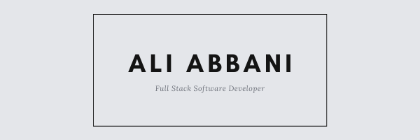

### Hi I'm Ali Abbani! 👋

   

  
   

## About Me 👋:

- 💻 I am currently a freelance full-stack software developer
- 🔭 I trained to become a full-stack software developer <a href="https://www.microverse.org/">Microverse Inc</a>
- 💻 Code: JavaScript, HTML/CSS, Bootstrap, Tailwind, Node.js, Express.js Ruby, Rails, React & Redux
- 👯 Degrees: Bachelor's Business Admistration
- 😄 Language: English, French, Arabic
- 🌱 Status: 'Currently learning and looking for a new job opportunity'
- 📫 Reach me on aliabbani08@gmail.com

## Stats

## Most Used Languages

